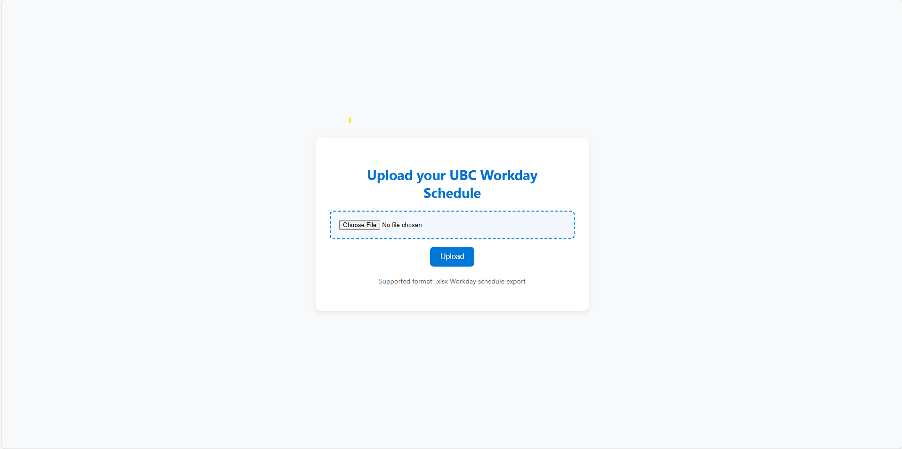

# UBC Auto Timetable

A Django-based web app that automatically generates interactive timetables from uploaded **UBC Workday** schedule Excel files.  
Users can upload their `.xlsx` files, view their course schedules in a clean modern UI, and download them as **PDF** or **image** for quick sharing.  

---

## Features

- Upload `.xlsx` schedule files directly from Workday  
- Auto-generate structured timetables from your data  
- Download timetable as **PDF** or **image (PNG)**  
- Simple SQLite3 database for local data persistence  
- Clean modern responsive design

---

## Technologies Used

- Python 3.10+
- Django 5.x
- SQLite3
- Pandas for Excel parsing
- OpenPyXL for reading .xlsx files
- Pillow for image rendering
- HTML5 / CSS3 (modern responsive layout)

## Screenshots

